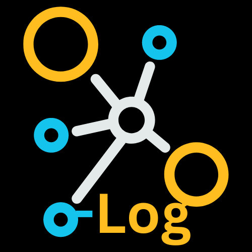

# API Logger Extension

  

Assists in capturing network request events on web pages using the chrome.debugger API. It specifically captures network events of type XHR and excludes requests for .json files.

### How to Install
1. clone this repo or download the source from [here](https://github.com/rndconfins/api-logger-extension/archive/refs/tags/v1.0.0.zip)
2. Open the Chrome extension configuration and enable developer mode.
3. Within the Chrome extension configuration, select "Load unpacked" from the `src` folder.
4. Pin the extension to complete the setup.

### How to Use
1. Navigate to the menu/page that you want to track.
2. Open the extension and click on `track API's`. A blue bar will appear at the top indicating that the extension is capturing all network events. Do not close or cancel this as it will stop the capture activity.
3. Proceed with using the page as usual.
4. When finished, click on the `cancel` or `x` button.
5. Reopen the extension and click on `Retrieve webRequest Log`. This will download a JSON file containing all captured network events.
6. Click on `Clear Log` to remove all captured network events